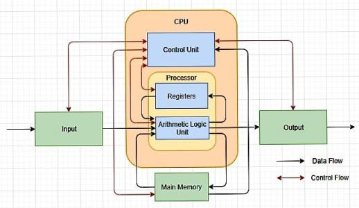
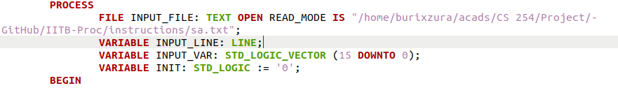
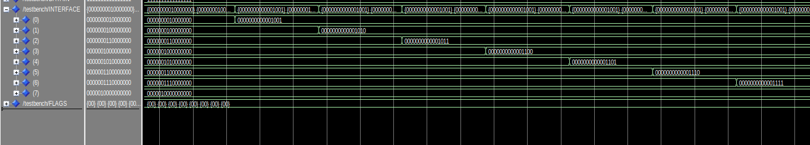
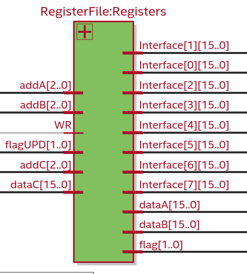
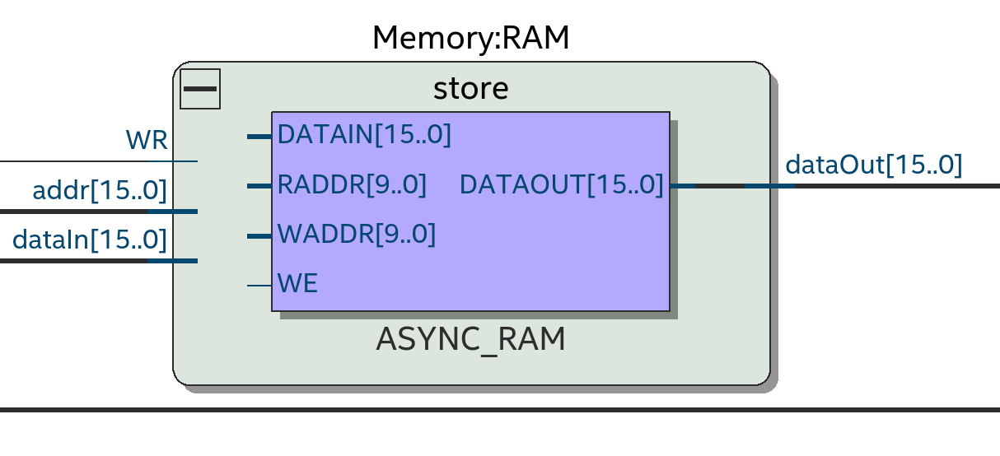
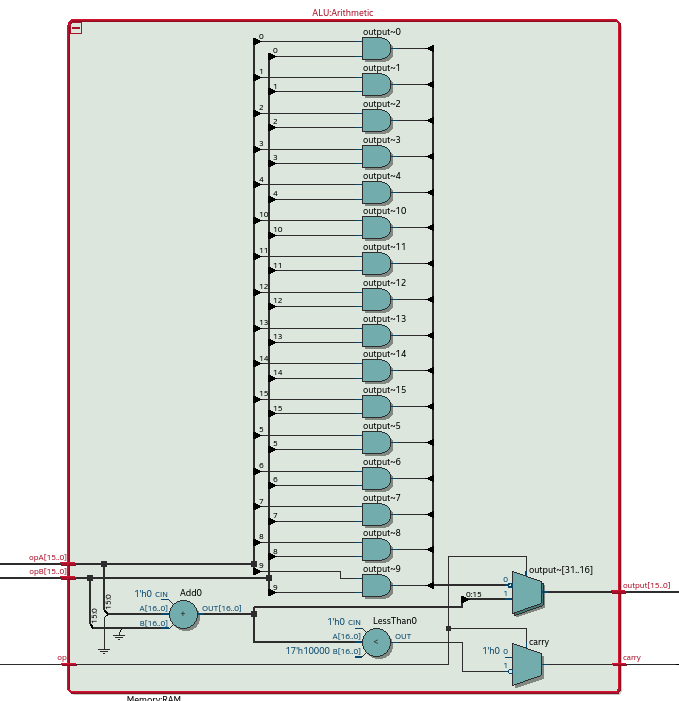
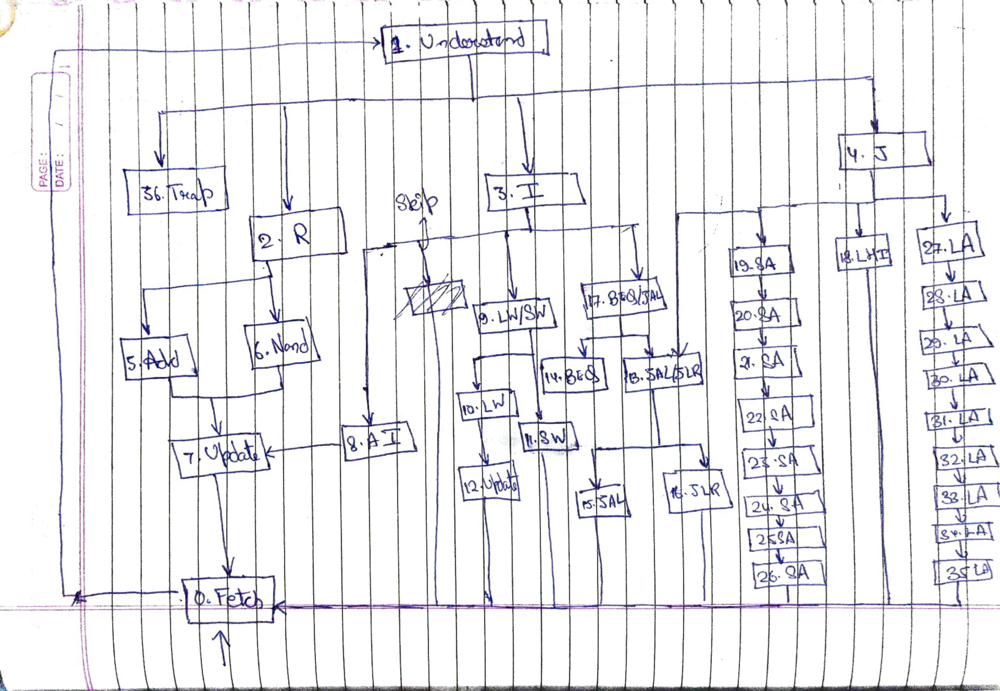

## Documentation

This is the documentation for the Digital Logic and Design (CS 226) course project. Project description is provided in the pdf document.

The design has 4 parts:

- Main Memory
- Register File
- Arithmetic Logic Unit
- Control Unit

You have to provide the path to an instructions' file, based on the syntax provided in the pdf, in the file, `TESTBENCH.vhd`.

 And the waveforms obtained from the simulation will give the entries in the register file at each interval.

There are 8 registers in the register file component so 8 outputs.

### Register File

This component stores 8 registers (a register file) and corresponding flags. 

**Component's interface:**

- 2 address pins (addA & addB) to get the data stored in the registers located at these addresses.
- 2 output data pins (dataA & dataB) which give the data.
- An Interface pin (Interface) which gives the state of all the registers to be shown in the simulation.
- An address pin (addC) to point the register whose state's to be updated.
- An input data pin (dataC) with which the register's to be updated.
- An input flag pin (flagUPD) to update the flag associated with that address.
- An output flag pin (flag) to show the current flag state of register at addC.
- A write pin (WR) to denote if we want to update the register at addC.

### Memory

Ideally according the the address size memory should consist of $2^{16}$ registers which is $2^{20}$ bits, but the device Max V can't load this big a design so memory is restricted to $2^{10}$ registers.

**Component's interface:**

- An address pin (addr) to locate the register in query.
- An output data pin (dataOut) to output the data in register at addr.
- An input data pin (dataIn) with which the register at addr is to be updated.
- A write pin (WR) to denote if we want to write the register at addr.

### ALU

This is the logical and arithmetic unit which implements addition and nand. 

**Component's interface:**

- Two input data pins (opA &opB) which are the two operands.
- An operation pin (op) to denote the operation to be performed (1 for addition and 0 for nand).
- An output data pin (output) which gives the resultant.
- A carry pin (carry) to denote if there's any carry associated with the resultant.

### Control Unit (Driving Logic)

This is the driving logic which connects all the units (components). It is the main file `IITB-Proc,vhd`.

The state transition diagram for this unit is:

- **State 0 : Fetch**

  Fetching the instruction from the memory to IR (Instruction Register) using PC (Program Counter).

- **State 1 : Understand**

  Reads the IR and check if it is R/I/J type or if it's termination signal.

- **State 2 : R**

  Increments PC. Breaks IR into parts according to the format for R type. Assorts if the operation is Nand or Add.

- **State 3 : I**

  Breaks IR into parts according to the format for I type. Assigns next state based on the type of operation. Checks whether the operation is undefined.

- **State 4 : J**

  Breaks IR into parts according to the format for J type. Assigns next state based on the type of operation. Increment PC based on the operation type.

- **State 5 : Add**

  Feeds the operands obtained from register file to ALU for addition. Checks for the flags.

- **State 6 : Nand**

  Feeds the operands obtained from register file to ALU for nand. Checks for the flags.

- **State 7 : Update**

  Updates the register with the output from ALU. Updates the flags.

- **State 8 : AI**

  Feeds ALU with Immediate (sign extended last 6 bits of IR) and data in register A for addition. Increments PC.

- **State 9 : LW/SW**

  Feeds ALU with Immediate and data in register B for addition. Increments PC.

- **State 10 : LW**

  Fetches output from ALU to memory unit as an address.

- **State 11 : SW**

  Feeds the data from registers to memory using output of ALU as an address.

- **State 12 : Update**

  Updates the register with the output from memory. Updates the associated flags.

- **State 13 : JAL/JLR**

  Stores PC in the desired register. Associates next state based on operation type. Updates the associated flags.

- **State 14 : BEQ**

  Checks if the register states are the same and updates PC likewise.

- **State 15 : JAL**

  Updates PC with the ALU output.

- **State 16 : JLR**

  Updates PC with the register file output.

- **State 17 : BEQ/JLR**

  Feeds the ALU with PC and immediate (sign extended last 6 bits of IR) for addition.

- **State 18 : LHI**

  Updates the register with Immediate (last 9 bits of IR right extended with zeroes). Updates the associated flags.

- **State 19-26 : SA**

  All the states update the memory sequentially.

- **State 27-35 : LA**

  All the states update the register file sequentially taking flag updation in account.

- **State 36 : Trap**

  Denotes the end of instructions and set trap to 1 to let the testbench know that the instruction set is completed.

- **Skip**

  Syntactically wrong operations are skipped and PC is incremented.

### Test Bench

It reads the instruction file and send the instructions to IITB-Proc with 'load signal' high to load it on the memory. It then sends an all 1's signal to denote end of the instruction set.

It shows the state of register file as the signal INTERFACE. It terminates when the trap signal arrives.

### Instruction Files

Files containing the instruction set. Format : One Instruction per line with the correct syntax. Combination of operations to test the system with varying complexities.

